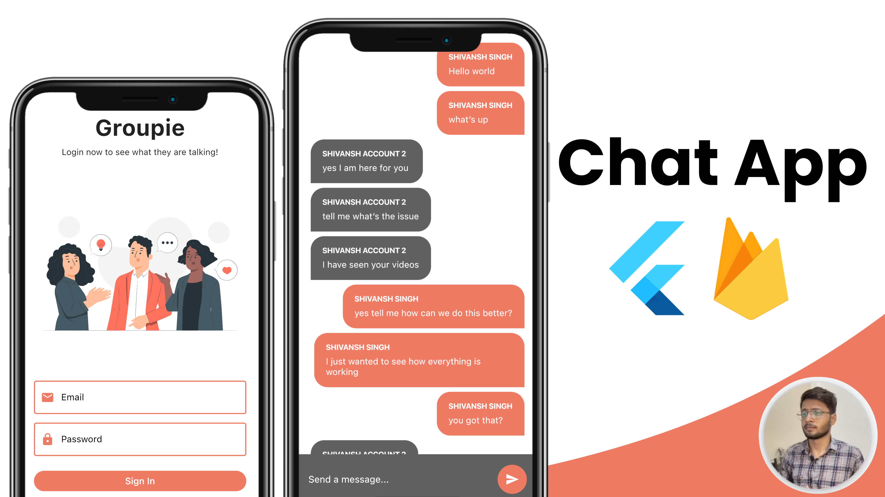

#chatapp_firebase
Group based chat app in Flutter and Firebase with Cloudfirestore, Firebase Auth and StreamBuilders 🔥

# Overview
Welcome to my project!

## Member's name
Contributing members of this application include:
- Nguyen Van Thanh
- Nguyen Van Manh

 ## SETTING IT UP
 1. Add firbease to this project and do check the google-services.json and GoogleServices-Info.plist file
 2. Now run the app

## Best wish
  Happy a nice day 👍

## Note
 I do not own any of the images used in this project.

For help getting started with Flutter, view our
[online documentation](https://flutter.dev/docs), which offers tutorials,
samples, guidance on mobile development, and a full API reference.

